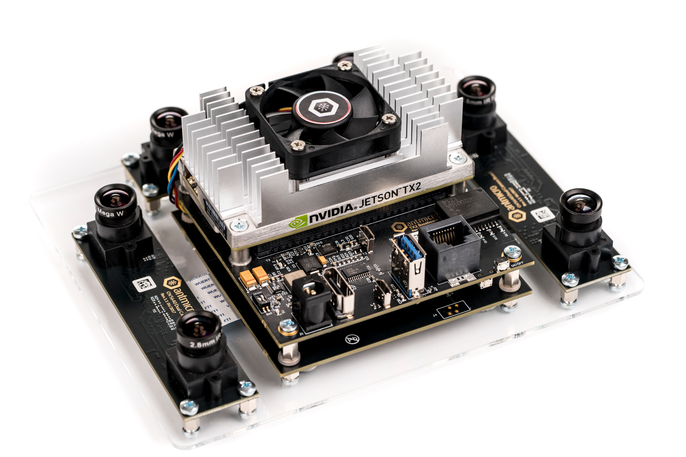
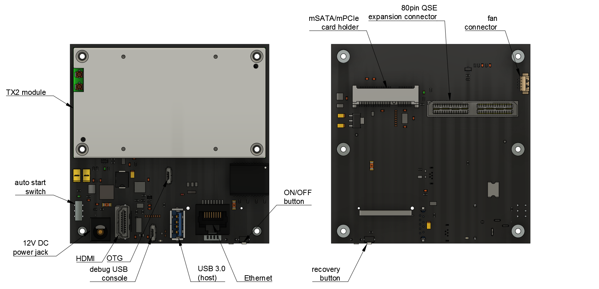

TX2 Deep Learning Kit BSP
=========================

 
This repository contains Linux kernel sources along with associated drivers and configuration files that allow to build a BSP image for the `Antmicro TX2 Deep Learning Kit <http://antmicro.com/products/tx2-tx2i-kit/>`_.
The kit contains a baseboard for `NVIDIA Jetson TX2 <https://developer.nvidia.com/embedded/buy/jetson-tx2>`_ module with typical IO interfaces and a set of six 5MP 1/4" MIPI CSI-2 image sensors with interchangeable M12 optics.

Building the BSP
----------------

Prerequisities
++++++++++++++

You will need a PC machine running Linux.
The following instructions are prepared for Ubuntu/Debian distributions.
You may need to adjust them for your distribution.
The provided BSP image is built on top of the example Jetson TX2 root filesystem provided by NVIDIA.
You will need to login to the `NVIDIA Jetson Download Center <https://developer.nvidia.com/embedded/downloads>`_ in order to get some resources.

Getting resources
+++++++++++++++++

#. Create a working directory::
    
     mkdir ~/tx2_workdir
     cd ~/tx2_workdir
#. Clone the kernel sources for the TX2 Deep Learning Kit from this repository::

     git clone https://github.com/antmicro/tx2-deep-learning-kit-bsp.git ~/tx2_workdir/
#. Download the `Linux for Tegra 28.2.1 for TX2 <https://developer.nvidia.com/embedded/dlc/tx2-driver-package-r2821>`_ driver package provided by NVIDIA for Jetson TX2 to ``tx2_workdir``.
#. Unpack this archive into the working directory::

     sudo tar xpf Tegra186_Linux_R28.2.1_aarch64.tbz2
#. Download the `root filesystem <https://developer.nvidia.com/embedded/dlc/sample-root-filesystem-r2821>`_ to ``tx2_workdir``.
#. Unpack the downloaded root filesystem into the ``Linux_for_Tegra`` directory::

     sudo tar xpf Tegra_Linux_Sample-Root-Filesystem_R28.2.1_aarch64.tbz2 -C ./Linux_for_Tegra/rootfs

Kernel compilation
++++++++++++++++++

#. Download a cross-compiler and extract it to a local toolchain directory::

     wget http://releases.linaro.org/components/toolchain/binaries/5.3-2016.02/aarch64-linux-gnu/gcc-linaro-5.3-2016.02-x86_64_aarch64-linux-gnu.tar.xz -P ~/tx2_workdir/
     mkdir ./toolchain
     tar xpf gcc-linaro-5.3-2016.02-x86_64_aarch64-linux-gnu.tar.xz -C ./toolchain
#. Set the build directory and environment variables::

     cd ~/tx2_workdir
     export ARCH=arm64
     export PATH=${PWD}/toolchain/gcc-linaro-5.3-2016.02-x86_64_aarch64-linux-gnu/bin/:$PATH
     export CROSS_COMPILE=aarch64-linux-gnu-
#. Set the compilation settings (``nproc`` is the number of CPU threads you want to compile on)::

     cd tx2-deep-learning-kit-bsp/kernel/kernel-4.4 
     make tegra18_antmicro_defconfig LOCALVERSION="-antmicro"
#. Compile the kernel and the devicetree (``nproc`` is the number of CPU threads you want to compile on)::

     make -j<nproc> LOCALVERSION="-antmicro"
     make -j<nproc> modules LOCALVERSION="-antmicro" 
     cp .config kernel_config
#. Make the package with modules and Linux headers so they could be installed locally on the Jetson TX2 module in the next steps::

     cd ~/tx2_workdir/tx2-deep-learning-kit-bsp/tx2-baseboard-module-install
     make all
     cd ../kernel/kernel-4.4
#. Replace the original Image and devicetree with compiled ones::

     cd ~/tx2_workdir
     sudo cp tx2-deep-learning-kit-bsp/kernel/kernel-4.4/arch/arm64/boot/Image Linux_for_Tegra/kernel/
     sudo cp tx2-deep-learning-kit-bsp/kernel/kernel-4.4/arch/arm64/boot/dts/tegra186-quill-p3310-1000-c03-00-base.dtb Linux_for_Tegra/kernel/dtb/tegra186-quill-p3310-1000-c03-00-base.dtb
     cd Linux_for_Tegra
     sudo ./apply_binaries.sh

Deploying the BSP
-----------------

In order to install the BSP image prepared in the previous step on the TX2 Deep Learning Kit you need to connect your PC to an USB-OTG port available on TX2 Deep Learning Kit.
It is advisable to use another USB port and connect the serial debug console as well.
Use the micro USB port marked with ``CONSOLE`` to connect the debug console to your PC. 
The debug console should appear as a new ``/dev/ttyUSBx`` device.
Moreover you will need a 12V DC power supply connected to the board.
The picture below shows a simplified PCB layout with relevant connectors and interfaces marked.

#. Make sure the AUTO START switch is in OFF (bottom) position.
   Connect the power supply to the ``J1`` connector.
   Press the recovery button (``REC``) located on the bottom side of the board, next to the ``ON/OFF`` button.
   Press the ``ON/OFF``  button for a while and then release the ``REC`` button.
   On your PC, type::

     lsusb
#. You should be able to see output similar to this::

     Bus XXX Device XXX: ID XXXX:XXXX NVIDIA Corp.
#. Now you can install the BSP on the TX2 module using the following command::

     sudo ./flash.sh jetson-tx2 mmcblk0p1
#. The process will take about 10 minutes. Once it finishes, you will see the following message::

     *** The target t186ref has been flashed successfully. ***
            Reset the board to boot from internal eMMC.
#. Open the debug console terminal on your PC.
   Set the baudrate of 115200 and point to the serial device on our PC that represents the serial console. 
   For ``picocom`` it will look like this.::

     picocom -b 115200 /dev/ttyUSBx
#. Login to the board using the following credentials::

     user: nvidia
     password: nvidia
#. On your PC go to the Linux sources directory and copy the ``tx2-bb-module-install.zip`` archive to your TX2 module. 
   You can use the ``scp`` command (you will need an Ethernet connection between the module and your PC)::

     cd ~/tx2_workdir/tx2-deep-learning-kit-bsp/tx2-baseboard-module-install
     scp tx2-bb-module-install.zip nvidia@<jetson_IP_address>:/home/nvidia
    
   You can use ``ifconfig`` command to check the Jetson's IP address.
   Alternatively you can use an USB flash drive for transferring the file.
#. On the TX2 module unzip the archive and then run the script which installs modules and Linux headers::

     unzip tx2-bb-module-install.zip
     sudo ./tx2-module-install.sh
#. After a while you should see the following message::

     Installation finished. You can now reboot the board.
#. Reboot the board with command::

     sudo reboot
#. Now you have a fully operational TX2 Deep Learning Kit.

Testing the cameras
-------------------

To run a video stream from cameras installed in the Deep Learning Kit you can use the following command (assuming you have connected the display via HDMI)::

     DISPLAY=:0 gst-launch-1.0 -vvv v4l2src device=/dev/video$ID ! 'video/x-raw,format=UYVY,width=1920,height=1080,framerate=30/1' ! nvvidconv ! 'video/x-raw(memory:NVMM), format=I420' ! nvoverlaysink

where ``$ID`` refers to the numerical ID of a particular sensor available in ``/dev/``. The picture below presents a relation between numeric indices and physical locations of the image sensors.
If you want to run more than one video streams at the same time you have to use ``xvimagesink`` instead of ``nvoverlaysink``. To do it, use the following command::

     DISPLAY=:0 gst-launch-1.0 -vvv v4l2src device=/dev/video$ID ! 'video/x-raw,format=UYVY,width=1920,height=1080,framerate=30/1' ! nvvidconv ! 'video/x-raw(memory:NVMM), format=I420' ! nvvidconv ! 'video/x-raw, format=I420' ! xvimagesink &

